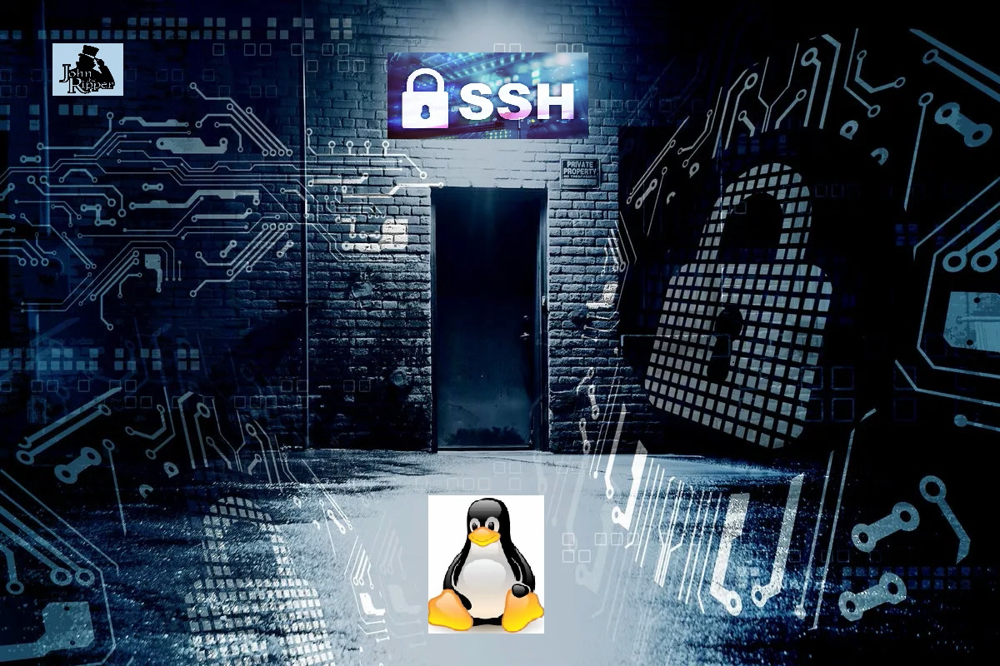

# Creating a Backdoor - Owning the System

Project: [Creating a Backdoor - Owning the System](/Creating%20a%20Backdoor%20-%20Owning%20the%20System.md)

## About this Project

This project explores one method to create a backdoor and gain persistence on a compromised machine.

There are several Pentesting phases, methodologies, or frameworks such as the Mitre and the Cyber kill Chain frameworks. This project focus on the fourth phase of engagement (Maintaining Access) or their equivalents like "Command and Control" for the cyber kill chain or "Persistence" for the Mitre framework.

To obtain this persistence, a backdoor is created using the SSH service. In short, two things need to be accomplished to succeed in this task: Create a user, and set the SSH server. 

---

## Tools used in the project

|   |   |
| --- | --- |
| - Virtual box --> Ubuntu machine (linux-scavenger_linux) | - Nano text editor |
| - Linux file system | - SSH |
| - SSH server configuration | - sudoers file configuration |
| - John the Ripper | - Commands: usermod, groupmod, adduser, sudo, su, systemctl, cat.